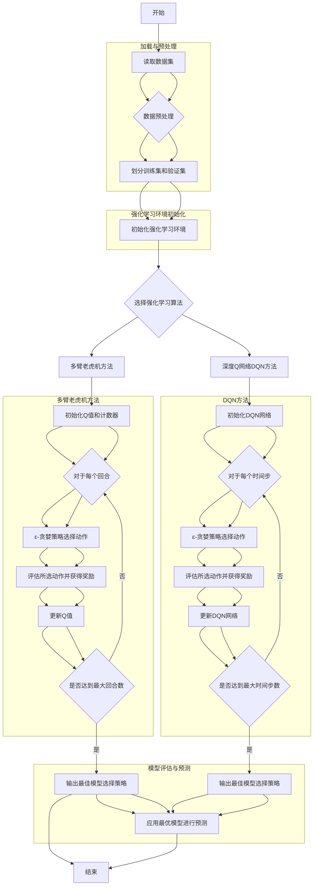
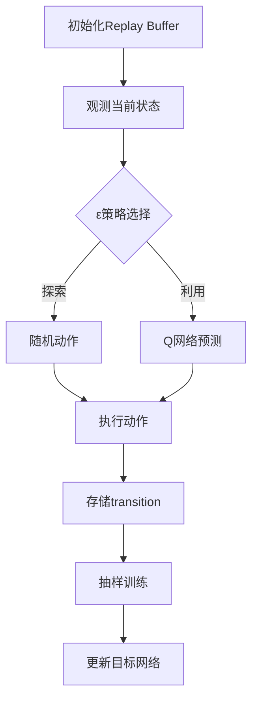
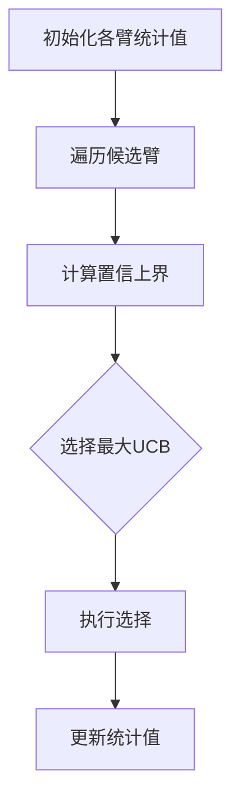

# 强化学习算法流程图对比

## 目录
- [并排对比](#对比流程图)
- [独立流程图](#独立流程图)

## 对比流程图

```mermaid
graph TD
    A[开始]:::start --> B[读取数据集]:::data
    B --> C{数据预处理}:::process
    C --> D[划分训练集和验证集]:::process
    D --> E[初始化强化学习环境]:::rl
    E --> F{选择强化学习算法}:::decision

    F --> G[多臂老虎机方法]:::bandit
    F --> H[深度Q网络DQN方法]:::dqn

    G --> I[初始化Q值和计数器]:::bandit
    I --> J{对于每个回合}:::bandit
    J --> K[ε-贪婪策略选择动作]:::bandit
    K --> L[评估所选动作并获得奖励]:::bandit
    L --> M[更新Q值]:::bandit
    M --> N{是否达到最大回合数}:::bandit
    N -->|否| J
    N -->|是| O[输出最佳模型选择策略]:::output
    O --> X[结束]

    H --> P[初始化DQN网络]:::dqn
    P --> Q{对于每个时间步}:::dqn
    Q --> R[ε-贪婪策略选择动作]:::dqn
    R --> S[评估所选动作并获得奖励]:::dqn
    S --> T[更新DQN网络]:::dqn
    T --> U{是否达到最大时间步数}:::dqn
    U -->|否| Q
    U -->|是| V[输出最佳模型选择策略]:::output

    O --> W[应用最优模型进行预测]:::predict
    V --> W[应用最优模型进行预测]:::predict
    W --> X[结束]

    subgraph 加载与预处理
        B --> C --> D
    end

    subgraph 强化学习环境初始化
        D --> E
    end

    subgraph 多臂老虎机方法
        I --> J --> K --> L --> M --> N
    end

    subgraph DQN方法
        P --> Q --> R --> S --> T --> U
    end

    subgraph 模型评估与预测
        O --> W
        V --> W
    end
```

## 独立流程图
### DQN独立流程

```mermaid
flowchart TD
    A[初始化Replay Buffer] --> B[观测当前状态]
    B --> C{ε策略选择}
    C -->|探索| D[随机动作]
    C -->|利用| E[Q网络预测]
    D --> F[执行动作]
    E --> F
    F --> G[存储transition]
    G --> H[抽样训练]
    H --> I[更新目标网络]
```

### Bandit独立流程

```mermaid
flowchart TD
    A[初始化各臂统计值] --> B[遍历候选臂]
    B --> C[计算置信上界]
    C --> D{选择最大UCB}
    D --> E[执行选择]
    E --> F[更新统计值]
```